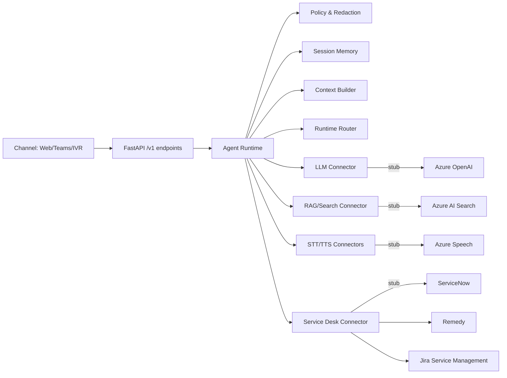

# Architecture

The gateway separates control-plane concerns (configuration, registry, policy) from delivery-plane execution (runtime request path). The FastAPI backend hosts a single agent runtime that owns memory and orchestrates connectors for every request.

## Control plane vs delivery plane
- **Control plane**: service registry, provider metadata, policies, and configuration. It defines what connectors exist and how they are described. Future work moves this to an admin API secured by Entra ID.
- **Delivery plane**: request-time execution path. The runtime enforces policy, builds context, calls connectors, and emits responses with correlation IDs and debug metadata.

## Components
- **Service Registry**: authoritative list of providers, models, voices, and statuses for each service type.
- **Agent Runtime**: orchestrates policy, memory, routing, connectors, and response shaping.
- **Memory Store**: gateway-owned session transcripts; swappable for Redis/Cosmos later.
- **Connectors**: mock and stub adapters for LLM, RAG, STT, TTS, and service desk providers.
- **Web UI**: static page that calls the API and lets operators select providers per request.

Azure-specific capacity and scaling assumptions for these components live in the [Azure Scalability Report](azure/scalability-report.md).
