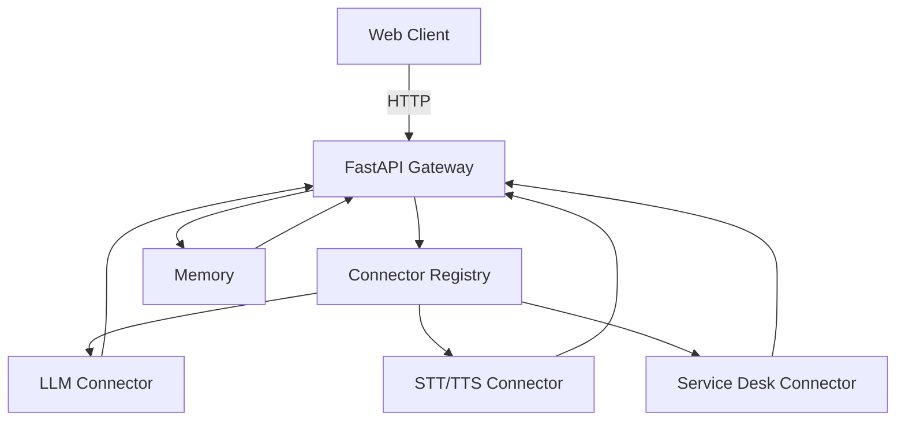

# Architecture

The Enterprise AI Gateway centers on a lightweight FastAPI control plane that brokers requests between clients and AI providers. The current demo ships with mocked connectors but follows a production-ready contract so you can swap in vendor SDKs later.

## Components

- **Gateway (FastAPI)**: Exposes a simple `/route` endpoint and health checks. It consults the registry to dispatch requests to connectors and stores short-term context in memory.
- **Connector Registry**: Tracks available providers and adapters. In the demo it uses an in-memory map, but the interface supports dynamic registration.
- **Memory**: Maintains per-session context and conversation history for continuity during orchestration.
- **Connectors**: Mock implementations for LLM, speech, and service desk interactions. Replace these with real SDKs when ready.

## Data flow

1. A client sends a message payload to `/route` with a `session_id` and `target` provider.
2. The gateway validates the request and checks the registry for a matching connector.
3. The connector returns a response; the gateway updates memory with the exchange.
4. The gateway returns a normalized response to the client.

## Extending the design

- Add middleware for authentication, rate limiting, and audit logging.
- Swap the in-memory registry with a database-backed catalog for multitenant deployments.
- Run multiple gateway instances behind a load balancer and back memory with Redis for horizontal scale.
