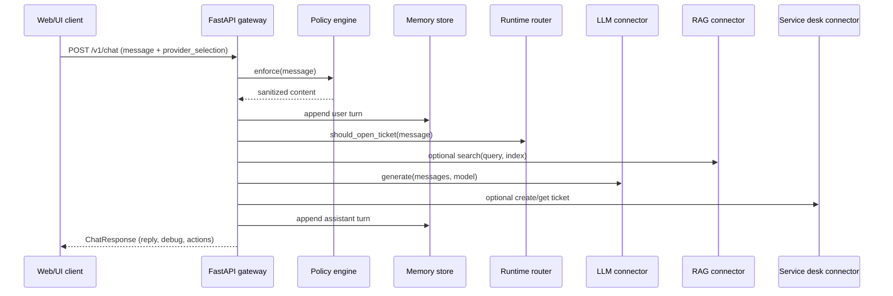

# Architecture

The Enterprise AI Gateway is a FastAPI backend with a thin static web UI. The backend owns session memory, routing logic, and a pluggable connector registry so new providers can be added without rewriting request handling.

## Component diagram
```mermaid
flowchart LR
    browser[Web UI]
    client[External clients]
    api[FastAPI Gateway]
    memory[In-memory session store]
    registry[Provider registry]
    llm[LLM connectors\n(mock, Azure OpenAI)]
    rag[RAG connectors\n(mock search, Azure AI Search)]
    speech[Speech connectors\n(mock, Azure Speech)]
    sd[Service desk connectors\n(mock, ServiceNow, Jira SM, Remedy)]

    browser -->|HTTP/JSON| api
    client -->|HTTP/JSON| api
    api --> memory
    api --> registry
    api --> llm
    api --> rag
    api --> speech
    api --> sd
    registry --> llm
    registry --> rag
    registry --> speech
    registry --> sd
```

## Main request flow


## Data flow and dependencies
- **API routes** wrap FastAPI endpoints in `app/api/` and delegate to the shared `AgentRuntime` instance created in `app/main.py`.
- **Policy** enforces message size and redacts PII before requests hit connectors.
- **Memory** keeps per-session turns in-memory for continuity; a persistent store (e.g., Redis) can be added later without changing the interface.
- **Runtime router** inspects text to decide whether to invoke a service-desk connector.
- **Registry** is configuration-driven and exposes provider metadata via `/v1/registry` so the UI can populate dropdowns.
- **Connectors** are async classes that normalize LLM, RAG, speech, and service-desk SDKs. Mock connectors are enabled by default for deterministic local development.

For Azure capacity and deployment considerations across the gateway and connectors, see the [Azure Scalability Report](azure/scalability-report.md).

## Local dependencies
- Python 3.11+
- Optional Azure SDK credentials if you want to exercise the Azure connectors; otherwise the mocks run with no secrets loaded.
- Node or other tooling is **not** required to run the backend API.
